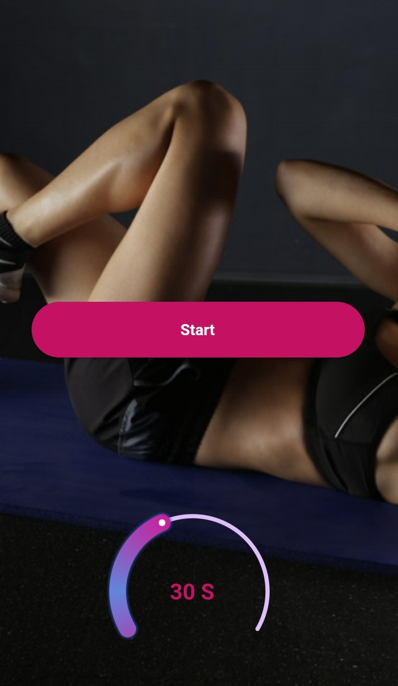
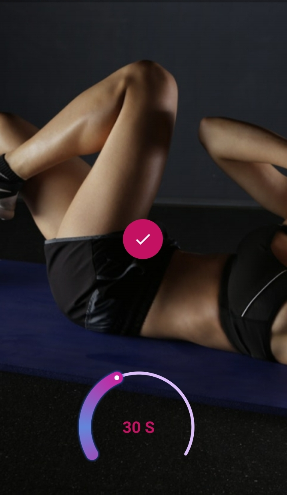
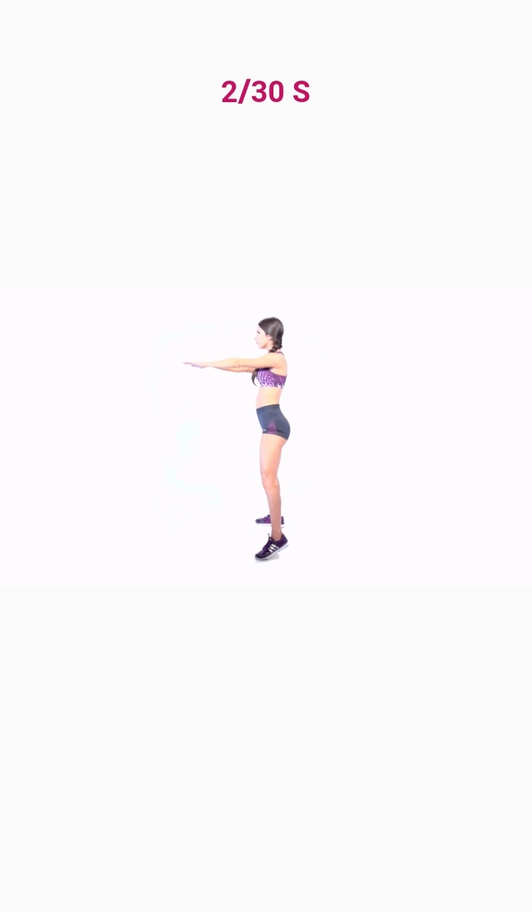
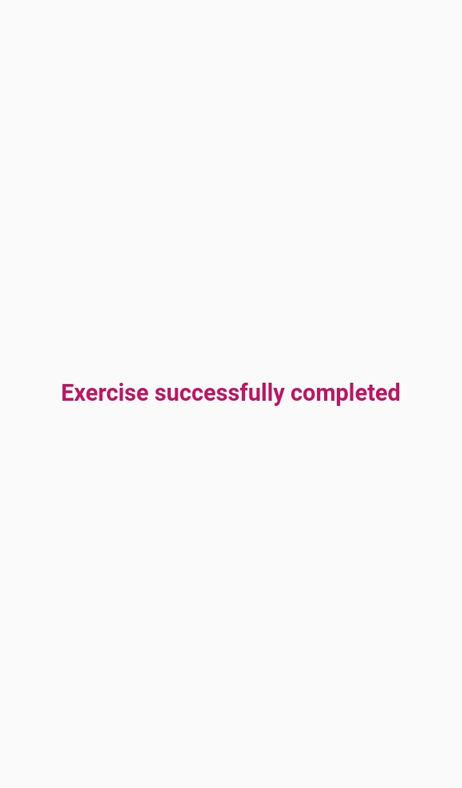

# Fitness App - Flutter UI

**Packages we are using:**

- cached_network_image: [link](https://pub.dev/packages/cached_network_image)

- introduction_screen: [link](https://pub.dev/packages/introduction_screen)

- sleek_circular_slider: [link](https://pub.dev/packages/sleek_circular_slider)

- rounded_loading_button: [link](https://pub.dev/packages/rounded_loading_button)

- animated_text_kit: [link](https://pub.dev/packages/animated_text_kit)

**Fonts**

- Poppins [link](https://fonts.google.com/specimen/Poppins)

**UI Credit**

- Design by: Lakhdar Ghazali

### Fitness App Final UI

## Screenshots
 HomePage              |  Transfer money page 
:-------------------------:|:-------------------------:
![]|

